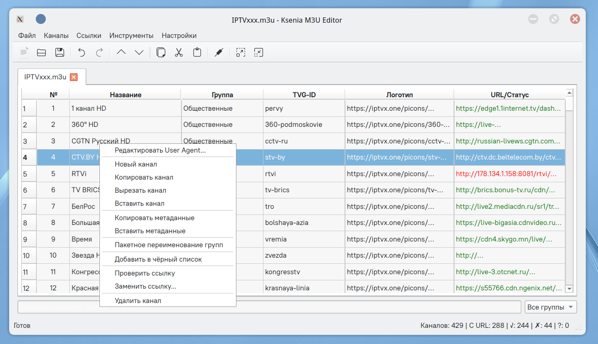
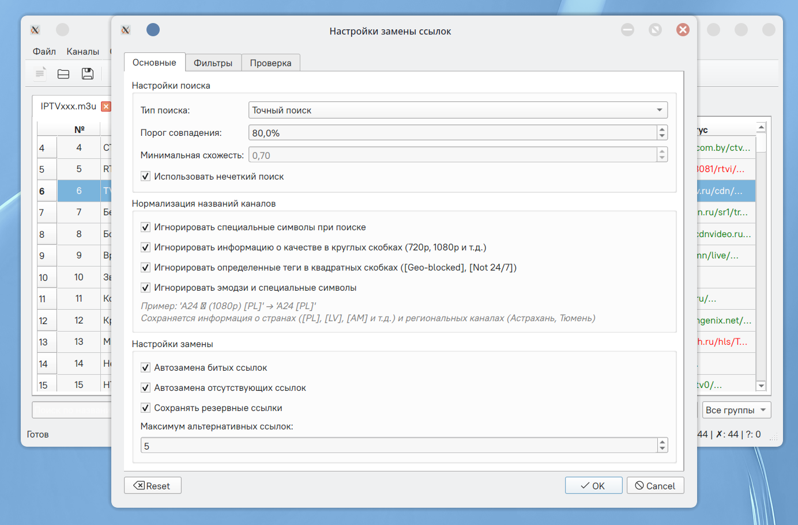
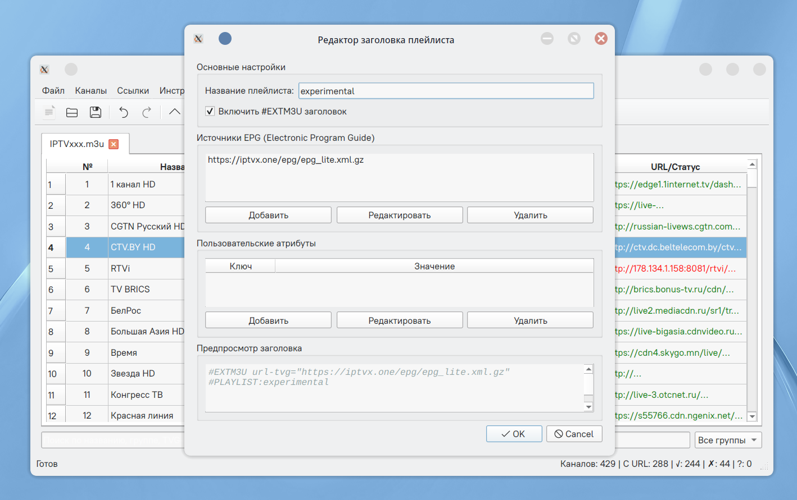

# Ksenia M3U Editor

Редактор M3U плейлистов для управления IPTV каналами с расширенными функциями проверки и замены ссылок. Редактор ещё в разработке, но уже может многое.




## 🚀 Возможности

### 📁 Управление плейлистами
- Открытие и сохранение M3U/M3U8 файлов
- Работа с несколькими вкладками 
- Импорт/экспорт плейлистов в различных форматах
- Отслеживание несохранённых изменений
- Автоматическое восстановление последней сессии

### 🎯 Редактирование каналов
- Встроенный редактор таблицы с возможностью прямого редактирования
- Добавление, удаление, копирование, вырезание и вставка каналов
- Перемещение каналов вверх/вниз (одиночное и множественное)
- Пакетное переименование групп каналов
- Поиск по названию, группе, TVG-ID и URL с подсветкой результатов
- Сортировка по любому столбцу

### 🔗 Управление ссылками
- Многопоточная проверка доступности URL (до 10 потоков)
- Автоматическая замена битых ссылок из различных источников
- Интеллектуальный поиск альтернативных ссылок
- Удаление всех ссылок или только битых
- Поддержка различных протоколов: HTTP, HTTPS, RTMP, RTSP, UDP, HLS
- Проверка SSL сертификатов с возможностью игнорирования ошибок

### 🏷️ Метаданные каналов
- Редактирование названий, групп, TVG-ID, логотипов
- Управление User-Agent и HTTP-заголовками
- Копирование и вставка метаданных между каналами
- Пакетное удаление метаданных (tvg-id, логотипы, группы, User-Agent, catchup)
- Автоматическое обновление #EXTINF строки при изменении

### 🔍 Интеллектуальный поиск и нормализация
- Умная нормализация названий каналов (исправление кодировки)
- Игнорирование информации о качестве (720p, 1080p, 4K, UHD, HD, SD)
- Игнорирование эмодзи и специальных символов
- Игнорирование Geo-блокировок и других технических тегов
- Поддержка нечёткого поиска и сравнения названий (алгоритм SequenceMatcher)



### 🔄 Управление дубликатами
- Поиск дубликатов по URL, названию или комбинации
- Удаление или объединение дублирующихся записей
- Сохранение альтернативных ссылок при объединении
- Предпросмотр результатов перед применением
- Выборочное удаление дубликатов

### 📚 Источники ссылок
- Управление несколькими источниками (локальные файлы, онлайн плейлисты)
- Приоритезация источников (1-10)
- Кэширование загруженных плейлистов для быстрого доступа
- Автоматическое обновление источников по расписанию
- Поддержка различных кодировок (UTF-8, Windows-1251, CP1251)
- Тегирование источников для удобной организации

### 🛡️ Фильтрация и безопасность
- Чёрный список каналов (по названию или TVG-ID)
- Фильтрация временных и небезопасных ссылок
- Белый/чёрный список IP-адресов и доменов
- Приоритезация ссылок из доверенных источников
- Автоматическая проверка URL перед заменой
- Валидация формата URL

### 🎨 Интерфейс и настройки
- Подсветка синтаксиса M3U с цветовой кодировкой
- Контекстное меню с быстрыми действиями
- Настраиваемая панель инструментов
- Поддержка горячих клавиш (30+ комбинаций)
- Система отмены/повтора действий (Undo/Redo) с историей до 50 шагов
- Адаптивный интерфейс с возможностью изменения масштаба
- Статусная строка с информацией о состоянии

### 🌐 Работа с заголовками
- Редактирование #EXTM3U заголовка плейлиста
- Управление источниками EPG (Electronic Program Guide)
- Добавление пользовательских атрибутов в заголовок
- Поддержка #PLAYLIST метаданных
- Визуальный предпросмотр заголовка



### 📊 Статистика и мониторинг
- Отображение количества каналов с URL
- Статус проверки ссылок (работает/не работает/не проверялось)
- Время ответа сервера в секундах
- Счетчик рабочих и нерабочих ссылок
- Время последней проверки

### 🔧 Расширенные возможности
- Создание плейлиста из нескольких источников
- Пакетная замена ссылок для выбранных каналов
- Проверка всех ссылок в плейлисте одним кликом
- Валидация URL перед добавлением
- Экспорт статистики
- Автоматическое исправление распространённых ошибок в M3U формате

## 📋 Требования

### Linux
- **Python**: 3.14 или выше
- **pip**: менеджер пакетов Python
- **PyQt6**: 6.6 или выше
- **requests**: 2.25.0 или выше
- **Системные библиотеки**: libxcb-xinerama0, libxcb-cursor0

### Windows
- **Вариант 1**: Портативный исполняемый файл (не требует установки Python, весит всего 40 мб)
- **Вариант 2**: Python 3.14+ с установленными зависимостями

## 🐧 Установка на Linux

### 1. Установка зависимостей

#### Ubuntu/Debian (20.04+)
```bash
# Обновление пакетов
sudo apt update

# Установка Python и pip
sudo apt install -y python3 python3-pip python3-venv

# Установка системных зависимостей PyQt6
sudo apt install -y python3-pyqt6 libxcb-xinerama0 libxcb-cursor0

# Дополнительные библиотеки (при необходимости)
sudo apt install -y libxcb-icccm4 libxcb-image0 libxcb-keysyms1 libxcb-randr0 libxcb-render-util0 libxcb-shape0 libxcb-xfixes0
